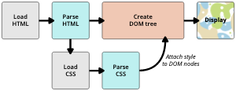

# Basic structure

## What is HTML Stand for?

**HTML** \(HyperText Markup Language\) is the most basic building block of the Web. It defines the meaning and structure of web content. 

## What does a doctype do? Explain DOCTYPE and why need it?

In HTML, the doctype is the required "`<!DOCTYPE html>`" preamble found at the top of all documents. 

Its sole purpose is to prevent a browser from switching into so-called “quirks mode” when rendering a document.

The "`<!DOCTYPE html>`" doctype ensures that the browser makes a best-effort attempt at following the relevant specifications, rather than using a different rendering mode that is incompatible with some specifications.

## What is the difference between HTML elements and tags?



The [element](https://developer.mozilla.org/en-US/docs/Learn/HTML/Introduction_to_HTML/Getting_started#Anatomy_of_an_HTML_element) is the **opening tag**, followed by **content**, followed by the **closing tag**.


[Attributes](https://developer.mozilla.org/en-US/docs/Learn/HTML/Introduction_to_HTML/Getting_started#Attributes) contain extra information about the element that won't appear in the content. In this example, the **`class`** attribute is an identifying name used to target the element with style information.

An attribute should have:

* A space between it and the element name. \(For an element with more than one attribute, the attributes should be separated by spaces too.\)
* The attribute name, followed by an equal sign.
* An attribute value, wrapped with opening and closing quote marks.

## What are self-closing tags / void tags / empty elements / singleton tags?

An empty element is an element from HTML, SVG, or MathML that cannot have any child nodes \(i.e., nested elements or text nodes\).

## What is the difference between attributions and properties?

Attributes are defined by HTML. Properties are defined by the DOM \(Document Object Model\).

## What’s the difference between a block-level element and an inline element?

Block-level elements form a visible block on a page — they will appear on a new line from whatever content went before it, and any content that goes after it will also appear on a new line. For example, paragraphs, lists, div, and so on.

A block-level element wouldn't be nested inside an inline element, but it might be nested inside another block-level element.

Inline elements are those that are contained within block-level elements and surround only small parts of the document’s content, not entire paragraphs and groupings of content. 

An inline element will not cause a new line to appear in the document; they would normally appear inside a paragraph of text, for example an &lt;a&gt; element \(hyperlink\) or emphasis elements such as &lt;em&gt; or &lt;strong&gt;.

## How is an HTML document structured? \(hint: What is DOCTYPE tag; HTML tag; Head tag; Body tag\)

1. `<!DOCTYPE html>`: The doctype. When HTML was young \(1991-1992\), doctype were meant to act as links to a set of rules that the HTML page had to follow to be considered good HTML. Doctype's used to look something like this:

```markup
<!DOCTYPE html PUBLIC "-//W3C//DTD XHTML 1.0 Transitional//EN"
"http://www.w3.org/TR/xhtml1/DTD/xhtml1-transitional.dtd">
```

More recently, the doctype is a historical artifact that needs to be included for everything else to work right. `<!DOCTYPE html>` is the shortest string of characters that counts as a valid doctype. That is all you need to know!

1. `<html></html>`: The [`<html>`](https://developer.mozilla.org/en-US/docs/Web/HTML/Element/html) element. This element wraps all the content on the page. It is sometimes known as the root element.
2. `<head></head>`: The [`<head>`](https://developer.mozilla.org/en-US/docs/Web/HTML/Element/head) element. This element acts as a container for everything you want to include on the HTML page, **that isn't the content** the page will show to viewers. This includes keywords and a page description that would appear in search results, CSS to style content, character set declarations, and more. You'll learn more about this in the next article of the series.
3. `<meta charset="utf-8">`: This element specifies the character set for your document to UTF-8, which includes most characters from the vast majority of human written languages. With this setting, the page can now handle any textual content it might contain. There is no reason not to set this, and it can help avoid some problems later.
4. `<title></title>`: The [`<title>`](https://developer.mozilla.org/en-US/docs/Web/HTML/Element/title) element. This sets the title of the page, which is the title that appears in the browser tab the page is loaded in. The page title is also used to describe the page when it is bookmarked.
5. `<body></body>`: The [`<body>`](https://developer.mozilla.org/en-US/docs/Web/HTML/Element/body) element. This contains _all_ the content that displays on the page, including text, images, videos, games, playable audio tracks, or whatever else.

## What you can do with a `<meta>` tag?

Meta tags represent the beginning of most SEO training, for better or for worse. Meta tags are some of the best tools in a search marketer's repertoire.

There are meta tags beyond just _description_ and _keywords_, though those two are picked on the most. 

* **Meta content type** – This tag is necessary to declare your character set for the page and should be present on every page. Leaving this out could impact how your page renders in the browser. A few options are listed below, but your web designer should know what's best for your site.

```markup
<meta http-equiv="Content-Type" content="text/html; charset=utf-8" />
```

```markup
<meta http-equiv="Content-Type" content="text/html; charset=ISO-8859-1">
```

* **Title** – While the title tag doesn’t start with "meta," it _is_ in the header and contains information that's very important to SEO. You should always have a unique title tag on every page that describes the page.
* **Meta description** – The infamous meta description tag is used for one major purpose: to describe the page to searchers as they read through the SERPs. This tag doesn't influence ranking, but it's very important regardless. It's the ad copy that will determine if users click on _your_ result. Keep it within 160 characters, and write it to catch the user's attention. Sell the page — get them to click on the result. Here's a great article on [meta descriptions](https://moz.com/learn/seo/meta-description) that goes into more detail.
* **Viewport** – In this mobile world, you should be specifying the viewport. If you don’t, you run the risk of having a poor mobile experience — the [Google PageSpeed Insights Tool will tell you more about it](https://developers.google.com/speed/docs/insights/ConfigureViewport). The standard tag is:

```markup
<meta name="viewport" content="width=device-width, initial-scale=1">
```

## Explain Document Flow of HTML.

Document flow is the arrangement of page elements as defined by positioning statements and the order of html statements; that is, how the different elements take up space and arrange themselves around each other.

