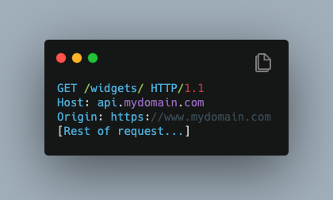
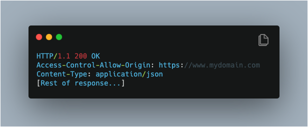
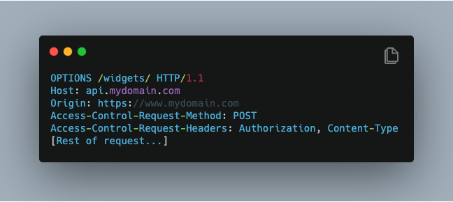
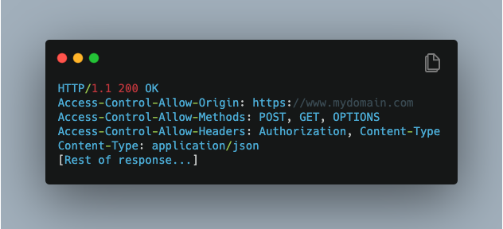
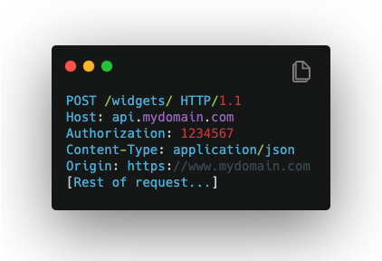
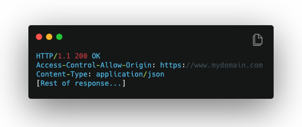

# Events and APIs 🚧

## What is Cross-Origin Resource Sharing \(CORS\)? And how does it works?

CORS is a **security mechanism** that allows a web page from one domain or Origin to access a resource with a different domain \(**cross-domain request\).**

Without features like CORS, websites are **restricted** to accessing resources from the same origin through what is known as **same-origin policy.**

There are often cases where you need to make AJAX \(i.e., Axios\) calls to `https://api.mydomain.com` or `https://mydomain` incorporates your Node.js server or some 3rd party fonts or analytics providers like Google Analytics. **Cross-Origin Resource Sharing \(CORS\)** enables these cross-domain requests**.**

> Allow Cross domain request, bypassing same-origin policy

## What is **same-origin policy?** <a id="9e0a"></a>

The **same-origin policy** is a critical security mechanism that restricts how a document or script loaded from one origin can interact with a resource from another origin

It helps isolate potentially **malicious** document, reducing possible attack vectors such as **CSRF attack**

> same-origin policy is security model for web application

## What is the definition of ‘origin’? <a id="8148"></a>

At this point, Someone might wonder the definition of **origin** 🤔

**Origin** includes the combination of protocol, domain, and port. In other words,

The following URLs are different origins

```text
https://www.google.com vs. https://www.api.google.comhttp://localhost:9000 vs. http://localhost:8080
```

While the following URLs are same origins

```text
http://www.example.com/dir/page.html 
vs. 
http://www.example.com/dir/page2.html
```


## How CORS works <a id="85b4"></a>

There are 2 types of CORS requests

1. simple requests
2. preflighted requests

### **1.Simple requests**

CORS request that does not require a preflight request

**Step 1**

A browser tab open to `https://www.mydomain.com` initiates AJAX request `GET` to `https://api.domains.com/widgets`

**Step 2**

Along with adding headers like `Host` , the browser automatically adds the `Origin` Request Header for cross-origin requests



**Step 3**

The server checks the `Origin` request header. If the Origin value is allowed, it sets the `Access-Control-Allow-Origin` to the value in the request header `Origin`



**Step 4**

When the browser receives the response, the browser checks the `Access-Control-Allow-Origin` header to see if it matches the origin of the tab

If not, the response is blocked

```text
Access-Control-Allow-Origin: * allows all origins
--> a large security risk
```

### **2. Preflighted requests**

A preflighted request is a CORS request where the browser is required to send a **preflight** request before sending the request being **preflighted to ask the server permission if the original CORS request can proceed**

**Any CORS request has to be preflighted if**

* **AJAX call to POST JSON data to a REST API meaning the `Content-Type` header is `application/json` → RESTful API request**
* AJAX call to an API which uses a token to authenticate the API in a request header such `Authorization` → **authorized request using token**

**Step 1**

The browser sends the `OPTIONS` request first \(aka the preflight request\)



**Step 2**

The server respond back specifying the allowed HTTP methods and headers. If the original CORS request intended to send a header or HTTP method not in the list, **failed**



**Step 3**

Since the **headers and method** pass the check `200 OK` , the browser sends the original CORS request \( `Origin` header in the request\)



**Step 4**

The response has the correct origin in `Access-Control-Allow-Origin` header so checks pass and control is handed back to the browser tab



## Give some samples of Browser Object Model \(BOM\).

## Explain RESTful API. What's the main features and why they're important?

## Explain Event Bubbling and Event Capturing?

