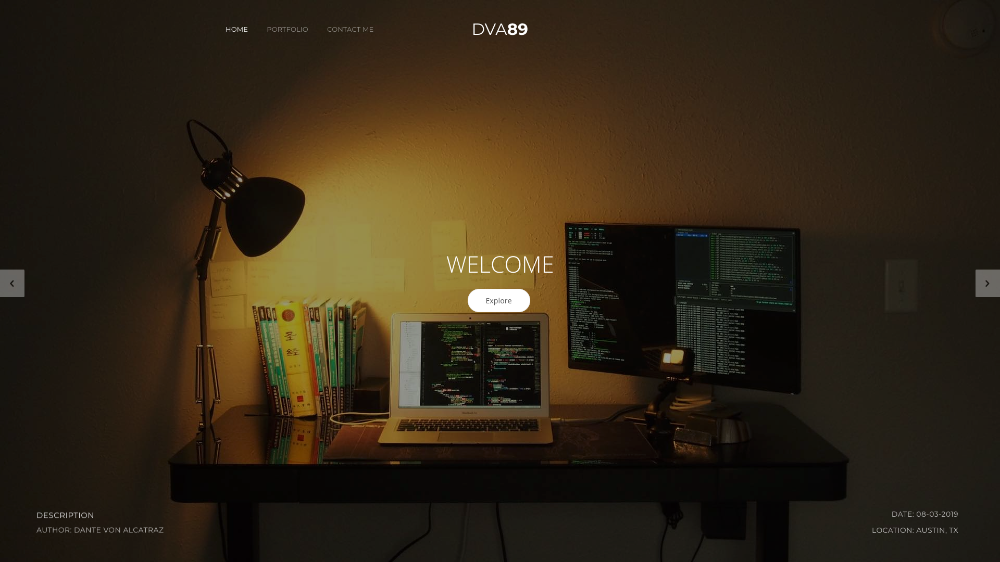
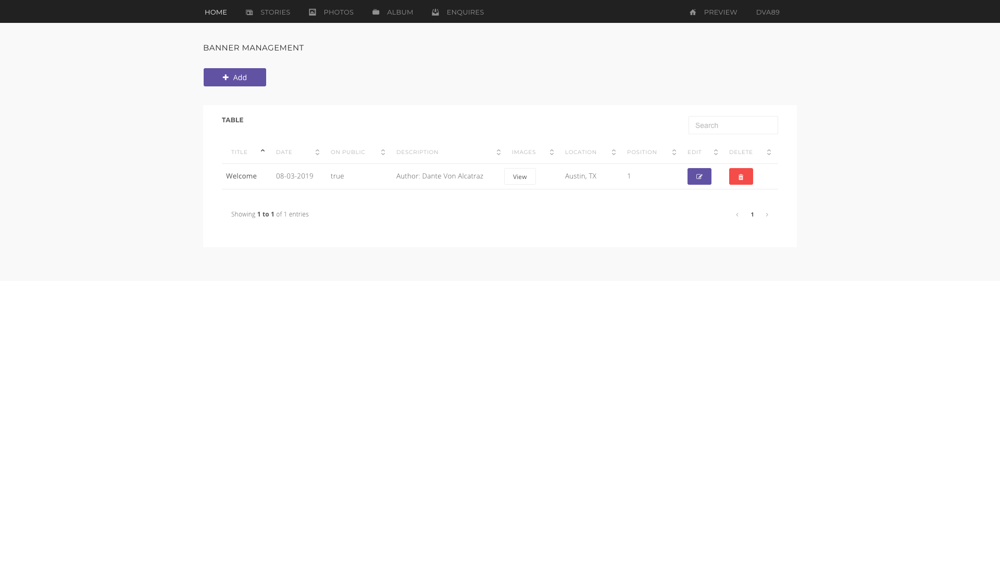
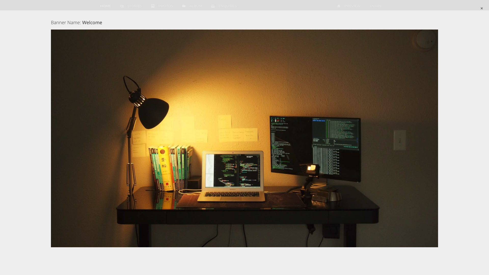
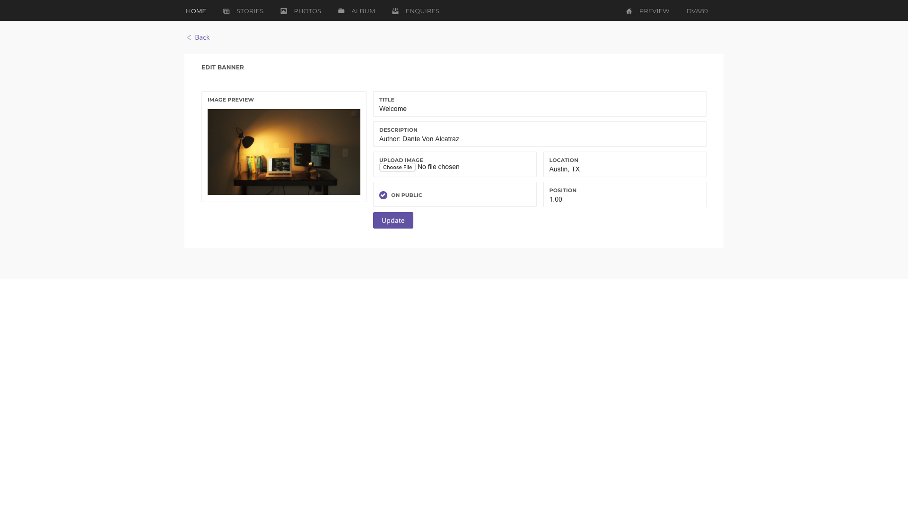
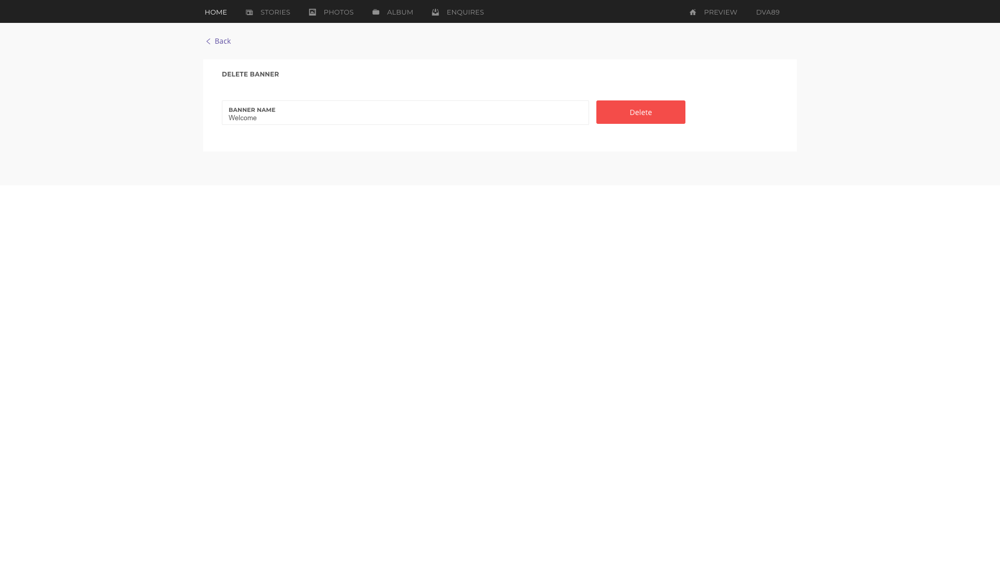

# Assignment Lists

## HTML&CSS Assignment:



## JavaScript Assignment1:



## JavaScript Assignment 2:



## React Assignment1:



## React Assignment2 \(Multiple Choices\):

### Rebuild JavaScript App into React App







And...

> For the Lucky and Strong

#### An agility CMS

Tech Sets: React, React-Router, React-Redux, Redux-middleware, FetchAPI, Material-UI or etc.

**Page: Front-end Display**

* Presentation: Carousel
* Schema Table

| Field | Type | Sample |
| :--- | :--- | :--- |
| Title | String | `"Welcome"` |
| Description | String | `"Author: Dante Von Alcatraz"` |
| Upload Image | Image Object | Background Image |
| Location | String | Real-time geolocation \(optional\) |
| On Public | Boolean | Determine data show or hidden |
| Position | Number | Order to display, e.q.: 1 \(in desc\) |

#### Page: CMS List Page

* Add new item button
* Edit item button
* Del item button
* View picture detail button
* Table: search bar; sortable; pagination

#### Page: Image Detail Page

* Page title
* Original size image

#### Page: Edit an item

* All fileds editable
* Upload image less then 1MB \([Post and Get](https://jsonplaceholder.typicode.com/guide.html)\)
* Using real-time geolocation \(optional\)

#### Page: Delete an item

* Delete chosen item

